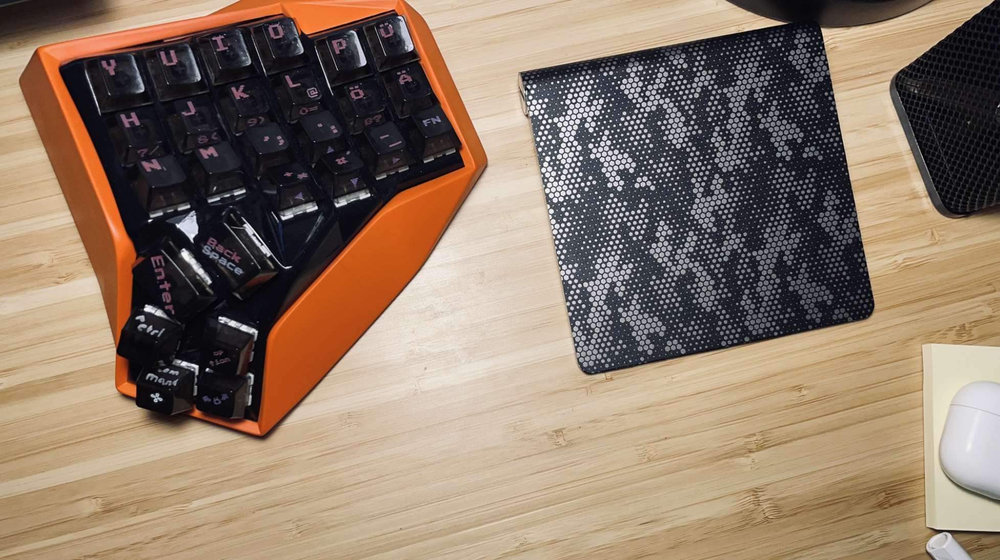

# amFaksu Keyboard

## Introduction

**amFaksu** is a custom mechanical keyboard designed for enthusiasts who appreciate a compact and efficient layout. This **split keyboard** offers an ergonomic typing experience by separating the halves, reducing strain, and enhancing comfort. It features **hot-swappable switches** and a **sturdy case**, making it an excellent choice for both beginners and experienced keyboard builders.

## Features
- **Compact and ergonomic split layout**
- **Hot-swappable Kailh PG511 sockets** for easy switch changes
- **Diode protection** with 1N4148WS (1206) for reliable performance
- **Sturdy M3 screw and nut mounting system**
- **3M silicone pads** for added stability and sound dampening
- **Compatible with ZMK firmware** for wireless functionality

## Components

| Component               | Quantity |
|-------------------------|----------|
| Case                    | 2        |
| 1u PCB                  | 2        |
| Kailh PG511 Socket      | 52       |
| 1N4148WS 1206 Diode     | 52       |
| M3x8 Screws             | ?        |
| M3x5x4.5 Nuts           | ?        |
| 3M Silicone pad (8x3mm) | ?        |

## Assembly Guide

1. **Prepare the PCB**  
   - Insert the diodes (1N4148WS 1206) and solder them.  
   - Install the Kailh PG511 sockets for hot-swappable switches.  

2. **Mount the PCB**  
   - Secure the PCB using M3x8 screws and M3x5x4.5 nuts.  

3. **Install the Case**  
   - Place the PCB into the case and ensure all components fit securely.  

4. **Attach Silicone Pads**  
   - Stick the 3M silicone pads for stability and sound dampening.  

5. **Install Switches and Keycaps**  
   - Insert your preferred mechanical switches and keycaps.  

## Firmware

The amFaksu keyboard runs on **ZMK firmware**, offering a fully customizable and wireless experience. ZMK is an open-source firmware designed for modern ergonomic and split keyboards, supporting Bluetooth connectivity, key remapping, and advanced macros.

### **Precompiled Firmware**
For convenience, a **precompiled firmware** is available, allowing users to flash the keyboard without compiling the code manually.

## Acknowledgments

Inspired by the open-source keyboard community, amFaksu is designed to be a **fun and accessible keyboard project**. Contributions and improvements are welcome!

## License

This project is **open-source** and licensed under the **MIT License**.
